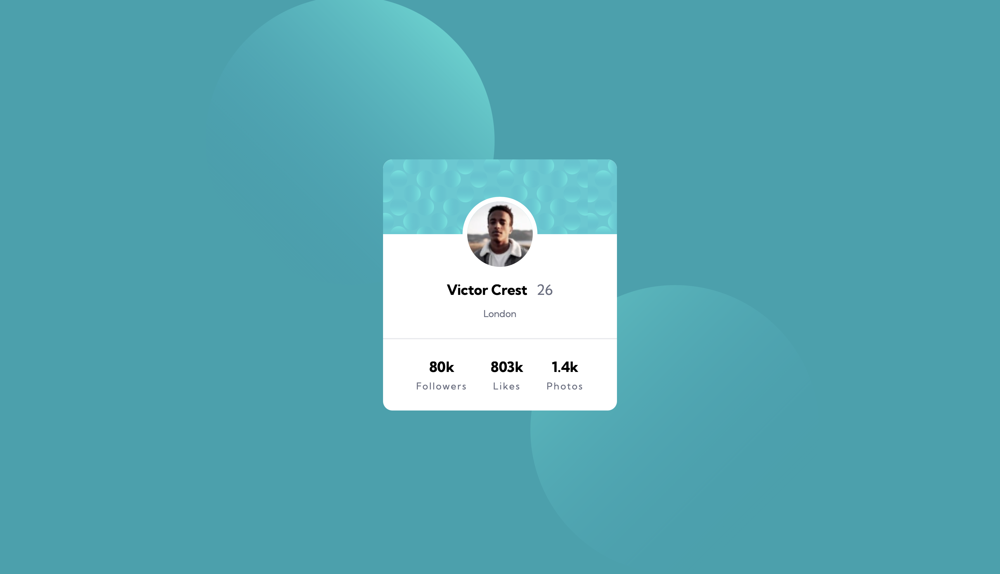

# Frontend Mentor - Social Media Profile Card component solution

This is a solution to the [Social Media Profile Card component challenge on Frontend Mentor](https://www.frontendmentor.io/challenges/social-media-profile-card-component-6d0DZLdxa). Frontend Mentor challenges help you improve your coding skills by building realistic projects.

## Table of contents

- [Overview](#overview)
- [The challenge](#the-challenge)
- [Screenshot](#screenshot)
- [Links](#links)
- [My process](#my-process)
- [Built with](#built-with)
- [What I learned](#what-i-learned)
- [Continued development](#continued-development)
- [Author](#author)

## Overview

### The challenge

Users should be able to:

- View the optimal layout for the component depending on their device's screen size
- See the profile card matching the provided design for both mobile and desktop breakpoints

### Screenshot



### Links

- Solution URL: [GitHub Repo](https://github.com/Agalya141/Profile_Card_Component)
- Live Site URL: [Live Demo](https://agalya141.github.io/Profile_Card_Component/)

## My process

### Built with

- Semantic HTML5 markup
- CSS Custom Properties (Variables)
- Flexbox layout model
- Mobile-first/Responsive workflow
- Media queries for desktop layout
- Google Fonts integration (Kumbh Sans)

### What I learned

This project focused on positioning an element precisely over two background layers, and on how a handful of small CSS properties silently break each other when combined carelessly. Specifically, I practiced:

1. **`position: absolute` centering:** Learned that centering an absolutely positioned element horizontally needs both `left: 50%` and `transform: translateX(-50%)` together — `left: 50%` alone only aligns the element's left edge to the center, not the whole element.
2. **Absolute positioning takes an element out of flex flow:** Discovered that giving a parent `display: flex` has no effect on a child that has `position: absolute`, since absolutely positioned elements are removed from the normal (and flex) layout flow entirely.
3. **`hr` styling needs `border`, not `color`:** Realized that a `<hr>` element's visible line color is controlled by its `border` (or `background-color` with an explicit height), not by the `color` property, which most browsers ignore for the rendered rule.
4. **Multiple background images need matching comma-separated values:** When using two background images on the same element, `background-position` and `background-size` must each provide comma-separated values in the same order as `background-image`, otherwise the wrong size/position gets applied to the wrong pattern.
5. **`width` overrides `max-width` in media queries:** Found that setting a fixed `width` in the base styles will keep overriding a `max-width` change inside a `@media` query — the `width` itself also needs to be updated at the breakpoint for the element to actually resize.

```css
/* Example: centering an absolutely positioned avatar image */
img {
  position: absolute;
  top: 4rem;
  left: 50%;
  transform: translateX(-50%);
  border-radius: 50%;
}
```

### Continued development

In future projects, I want to focus on:

- Using browser DevTools to live-adjust properties like `background-size` and `background-position` before writing final values into the CSS file, instead of guessing and refreshing repeatedly.
- Double-checking that every property changed for a desktop breakpoint (width, size, position) is updated together, rather than changing only one and assuming the rest carries over.
- Planning background-pattern positioning against the actual design file measurements early, rather than adjusting it late in the process.

## Author

- GitHub - [@Agalya141](https://github.com/Agalya141)
- Frontend Mentor - [@Agalya141](https://www.frontendmentor.io/profile/Agalya141)
- LinkedIn - [Agalya M](https://www.linkedin.com/in/agalya6)